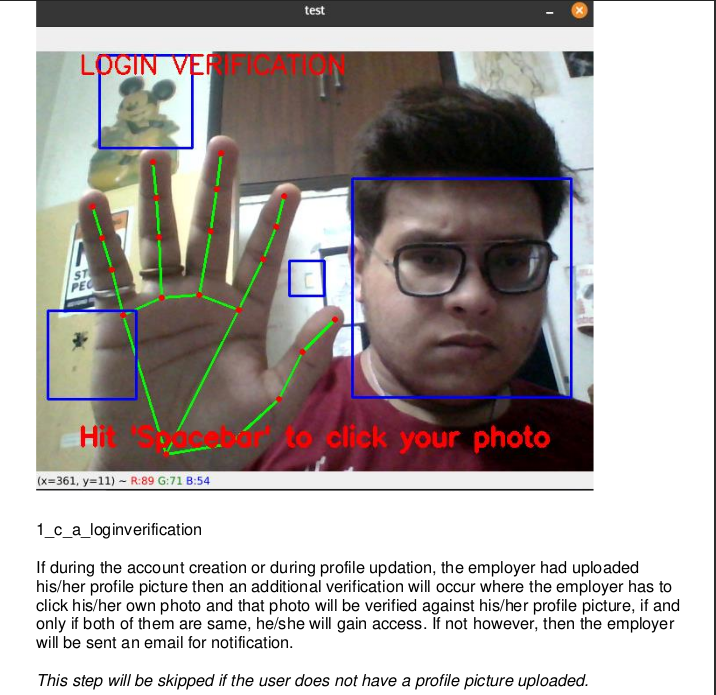
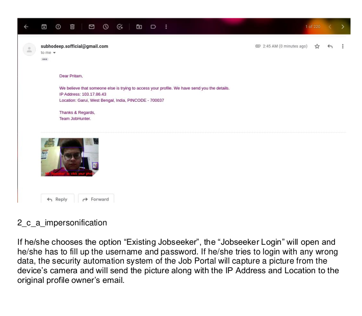
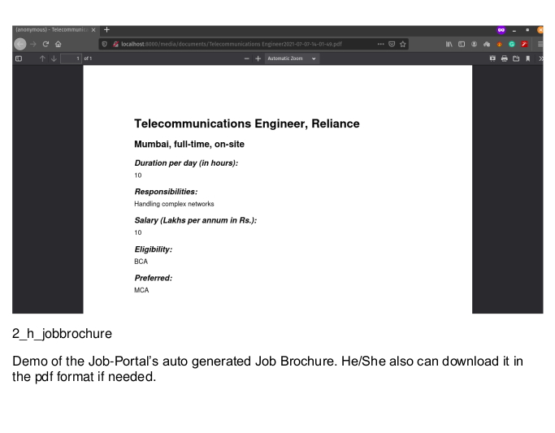
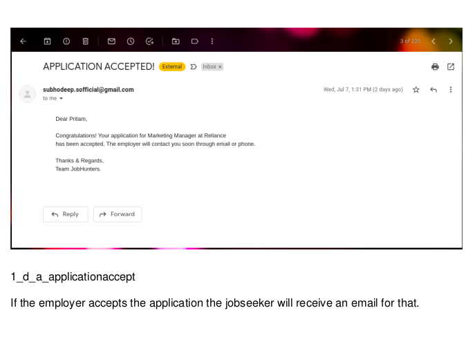

# SmartJobPortal
#### Online Job portal made with Django and uses Email Automation, PDF Automation & Computer Vision

*Final Semester Major Project for the completion award of UG Degree 'Bachelor of Computer Application' 2021*
****

## Disclaimer
This is not the original repository. The private copy has sensitive information, but I wanted this to be added on GitHub. So, I modified the original project to remove any previous sensitive data

## Usage:

- Install the required packages with ``pip3 install <PACKAGE>``
  
    - Django
    - DeepFace
    - Cv2
    - Reportlab
- Now start the local development Django server with ``python manage.py runserver``

## Here are some of the best features:

If you want to see the full documentation then  <a href="documentation.pdf">Download PDF</a>.

